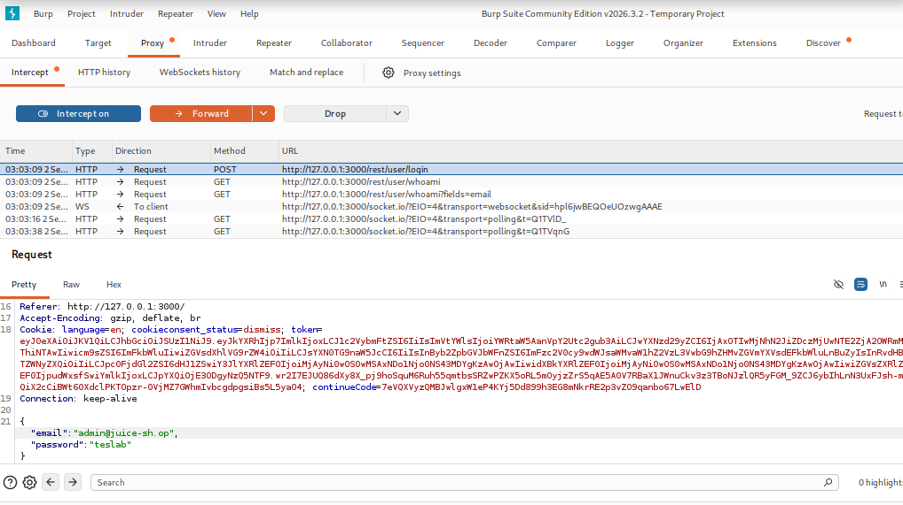
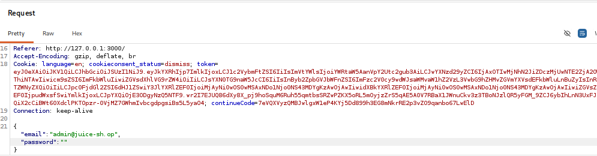
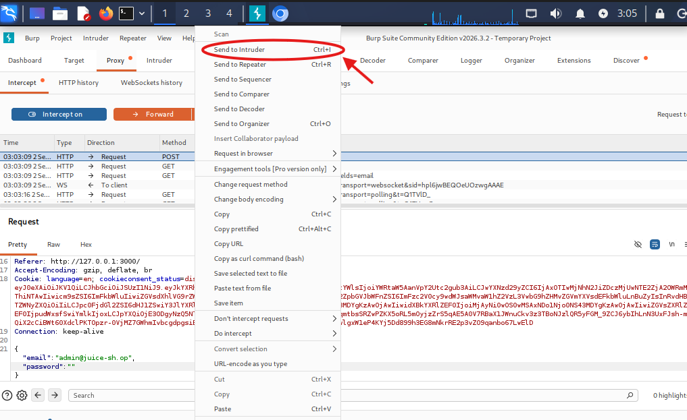
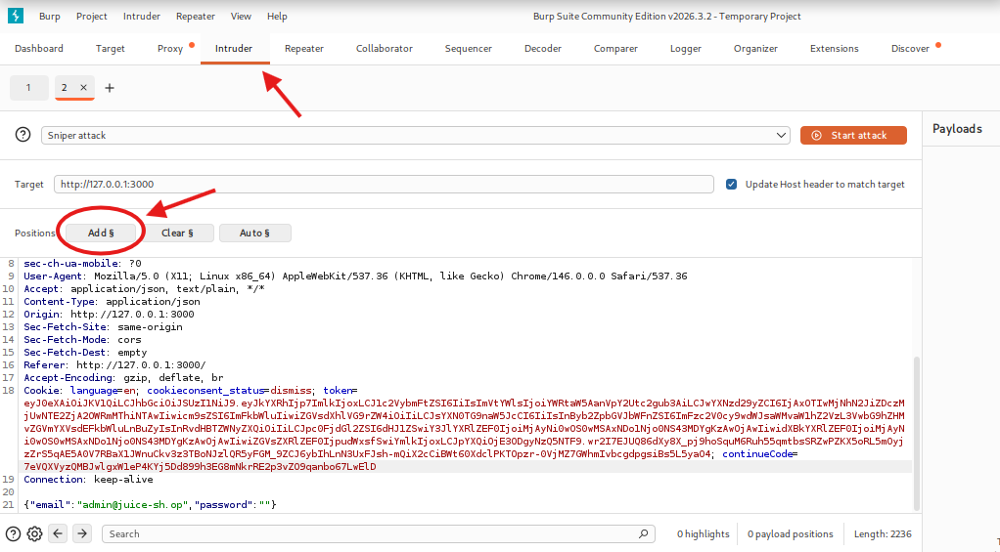
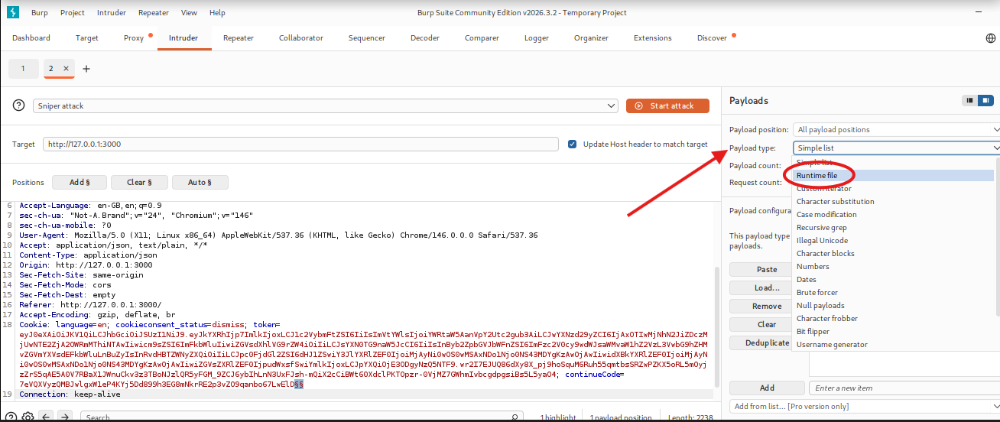
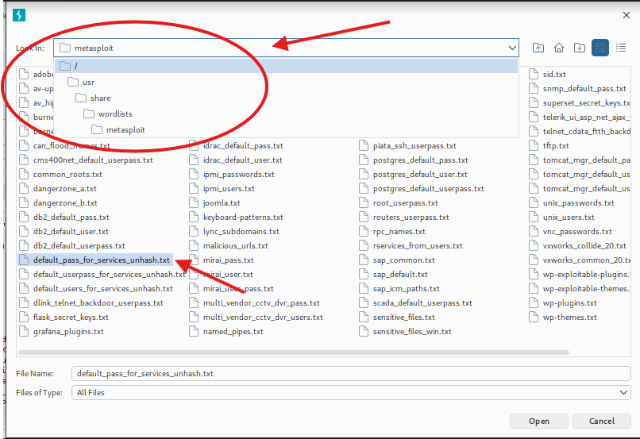
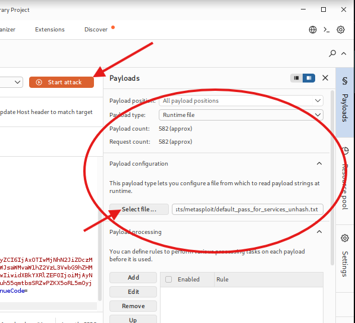
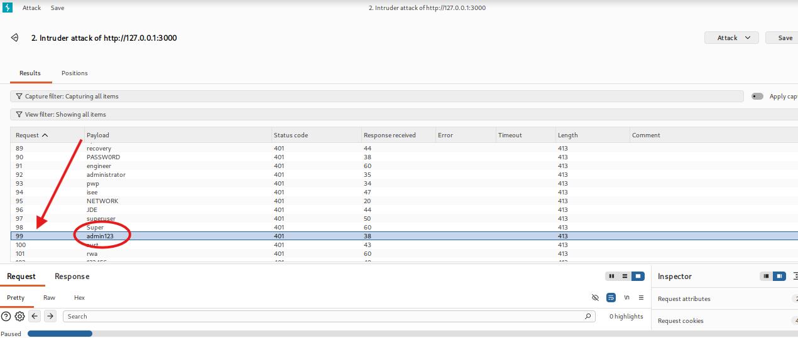
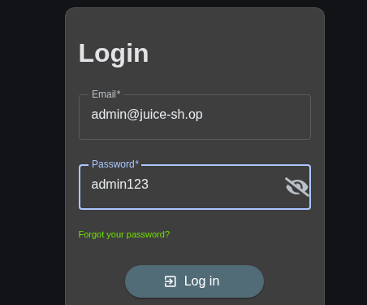
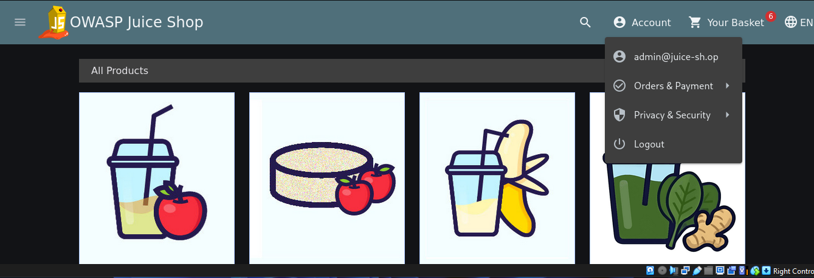

# 🔐 OWASP Juice Shop - Brute Force Attack

## 📌 Overview
This project demonstrates a brute force attack on the OWASP Juice Shop login system using Burp Suite.

---

## 🎯 Objective
To identify valid login credentials by attempting multiple passwords automatically.

---

## 🧪 Attack Method
1. Captured login request using Burp Suite
2. Sent request to Intruder
3. Selected password field
4. Used Sniper attack
5. Loaded wordlist from Kali Linux
6. Executed brute force

---

## 💥 Result
✅ Found valid credentials:
- Email: admin@juice-sh.op  
- Password: admin123  

Successfully logged in.

---

## 📸 Screenshots

---

## 🛠 Tools
- Kali Linux
- Burp Suite
- OWASP Juice Shop

---

## 🛡 Mitigation
- Account lockout
- Rate limiting
- Strong passwords
- MFA

  
## 🧠 What I Learned
- How brute force attacks work in real scenarios
- Using Burp Suite Intruder for automated attacks
- Identifying valid credentials via response analysis
